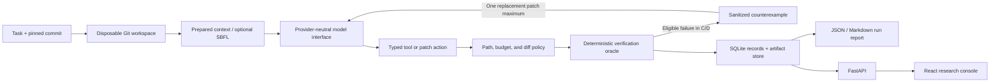

<div align="center">

# AgentTrace

**A research platform for measuring how deterministic verification and one bounded repair attempt affect LLM-generated software patches.**


[Research Contract](docs/project-charter.md) · [Experimental Methodology](docs/experiment/experimental-methodology.md) · [Metrics](docs/experiment/metrics.md) · [Benchmark Evidence](docs/benchmark-evidence.md)

</div>

## Overview

Coding agents can produce patches that look plausible, apply cleanly, and even pass visible tests while still failing held-out behavior or introducing regressions. AgentTrace studies whether deterministic software-engineering evidence can improve those patches without turning evaluation into an unlimited retry loop.

The primary research question is:

> **How much do deterministic verification gates and bounded repair loops improve the reliability of LLM-generated software patches?**

AgentTrace evaluates this question through controlled configurations that separate direct generation, repository-tool access, verification feedback, and research-enhanced evidence. Every run is tied to a fixed task and repository commit. Generated changes are represented as unified diffs, applied only inside disposable Git workspaces, verified through configured gates, and retained with structured traces and artifacts.

The broader study also examines:

- whether benchmark-oracle strength, measured through mutation testing, is associated with repair reliability;
- whether shrunk Hypothesis counterexamples improve edge-case repair;
- whether Ochiai fault localization reduces files inspected, lines exposed, tokens, or latency; and
- whether optional CrossHair/Z3 analysis finds counterexamples on suitable contract-oriented tasks.

## Core capabilities

| Capability                    | Implementation                                                                                                                                                               |
| ----------------------------- | ---------------------------------------------------------------------------------------------------------------------------------------------------------------------------- |
| Controlled patch generation   | Provider-independent model interface with typed `tool_call` and `submit_patch` actions; no prose parsing controls execution.                                                 |
| Constrained repository access | Bounded `list_tree`, `read_file`, and `search_code` tools with traversal, symlink, hidden-test, `.git`, path-policy, and output protections.                                 |
| Deterministic verification    | Patch policy, compilation, visible tests, full tests, hidden tests, and eligible Hypothesis properties, with configurable Ruff, mypy, Bandit, and CrossHair checks.          |
| Bounded repair                | A CEGIS-inspired sequence preserves P0, returns one sanitized counterexample when eligible, resets to the original commit, evaluates one complete replacement P1, and stops. |
| Fault localization            | Per-test Coverage.py spectra and inspectable Ochiai scores with deterministic Top-K ranking.                                                                                 |
| Benchmark qualification       | Fixed repository bundles, hidden evaluator tests, known-correct patches, and a pytest-gremlins adapter for normalized mutation metrics.                                      |
| Reproducible evidence         | SQLAlchemy/SQLite records, content-addressed artifacts, stable run identifiers, resumable matrices, redacted traces, and immutable raw exports.                              |
| Run reporting                 | Deterministic structured JSON and Markdown reports generated from stored evidence without another LLM call.                                                                  |
| Local research interface      | FastAPI endpoints and a React/TypeScript frontend for task creation, A/B/C/D runs, run history, experiment summaries, and reports.                                           |

## Experimental configurations

All configurations use the same task format and common run schema. Within a comparison, the model, task statement, base commit, patch policy, budgets, and final evaluation are intended to remain fixed.

| Configuration                   | Repository access                   | Research evidence                                                    | Verification feedback                  | Repair allowance            |
| ------------------------------- | ----------------------------------- | -------------------------------------------------------------------- | -------------------------------------- | --------------------------- |
| **A — Direct Patch**            | Deterministic prepared context only | None                                                                 | None                                   | 0                           |
| **B — Tool Agent**              | Bounded read-only repository tools  | None                                                                 | None                                   | 0                           |
| **C — Verified CEGIS**          | Same bounded tools as B             | None                                                                 | Structured, sanitized failure evidence | At most 1 replacement patch |
| **D — Research-Enhanced CEGIS** | Bounded repository tools            | Pre-agent Ochiai ranking; eligible Hypothesis and CrossHair evidence | Structured, sanitized failure evidence | At most 1 replacement patch |

## System architecture



The code uses explicit Pydantic contracts and small application services rather than an external agent framework. The persistent research model includes `Repository`, `Task`, `BenchmarkQuality`, `Run`, `FaultLocalizationResult`, `PatchArtifact`, `VerificationResult`, `Counterexample`, `TraceEvent`, and `RunReportRecord`.

### Execution boundary

AgentTrace executes benchmark code natively on Windows. Each verification run uses a disposable workspace at the recorded commit, an explicit working directory, argument-array subprocess invocation, a sanitized environment, bounded output, hard timeouts, and process-tree termination. A temporary Python virtual environment is used where required. Provider credentials and unrelated host secrets are not forwarded to benchmark subprocesses.

These controls support repeatable local experiments; they are not a security sandbox. AgentTrace is restricted to curated benchmark repositories or external repositories that the user explicitly trusts for local execution.

## Technology stack

| Layer                      | Technologies                                                              |
| -------------------------- | ------------------------------------------------------------------------- |
| Backend                    | Python, FastAPI, Uvicorn, Pydantic, pydantic-settings                     |
| Persistence                | SQLAlchemy 2, SQLite                                                      |
| Model integration          | Provider-neutral `ModelProvider`, Gemini Developer API, Google Gen AI SDK |
| Repository handling        | Git bundles/clones, disposable workspaces, unified diffs                  |
| Verification               | pytest, Coverage.py, pytest-cov, Hypothesis, Ruff, mypy, Bandit           |
| Optional symbolic analysis | CrossHair, Z3                                                             |
| Mutation qualification     | pytest-gremlins                                                           |
| Frontend                   | React 19, TypeScript, Vite, Tailwind CSS, React Router, TanStack Table    |
| Analysis environment       | pandas, matplotlib                                                        |

## Experimental methodology

### Benchmark design

The candidate benchmark version is `benchmark-v1.0.0`. It contains 15 small deterministic Python repair tasks covering boundary conditions, validation and business rules, parsing, data transformation, algorithms, and API/application logic.

Each task includes:

- a YAML manifest and fixed base commit;
- a portable Git bundle;
- visible tests and evaluator-owned hidden tests;
- allowed and forbidden repository paths;
- a known-correct unified diff;
- expected baseline outcomes; and
- optional property or symbolic profiles where the task is suitable.

Qualification reproduces the baseline defect, applies the reference patch, verifies corrected visible and hidden behavior, resets the workspace, and runs pytest-gremlins. Mutation testing is benchmark metadata only; it does not run after every generated patch. AgentTrace normalizes killed, survived, excluded, skipped, invalid, and unusable gremlins into `BenchmarkQuality` and computes:

```text
mutation score = killed / (killed + survived)
```

Invalid or unusable mutations are retained separately rather than counted as ordinary survivors.

### Verification protocol

Required candidate gates run in this order:

1. patch application and path/size policy;
2. Python syntax and compilation;
3. targeted visible tests;
4. complete existing/baseline tests;
5. hidden tests;
6. configured Hypothesis properties.

Ruff, mypy, Bandit, and CrossHair are advisory unless a frozen verification profile declares otherwise. Baseline outcomes are stored separately so an existing failure can be distinguished from a patch-induced regression. Hidden-test source and identifiers remain outside agent-readable repository paths and artifacts.

### Metrics and validity

The primary metric is:

> **Task Resolution Rate (TRR) = 100 × resolved valid runs / all valid runs**

A run is resolved only when the final patch applies, every required fail-to-pass check passes, and every pass-to-pass regression check remains passing. Provider outages and evidenced harness failures are reported as missing infrastructure data. Model refusals, malformed actions, unsafe patches, tool-budget exhaustion, application failures, and incorrect patches remain valid unresolved runs.

Secondary measures include first-patch success, repair success, regression rate, invalid-patch rate, mutation score, SBFL true-fault rank, files inspected, lines exposed, tool calls, token use, estimated cost, latency, and patch size. The predeclared analysis uses paired task comparisons, effect sizes, uncertainty intervals, and descriptive medians rather than treating a small benchmark as evidence of broad statistical generality.

### Trace and report data

Each terminal run can retain task/configuration metadata, model parameters, tool calls, files and lines exposed, P0/P1 patches, verification gates, counterexamples, SBFL evidence, tokens, cost, latency, final resolution, and failure classification. Raw JSON exports are immutable; manually reviewed classifications and later analyses belong in a separate derived namespace.

The report service reconstructs one completed run from stored evidence. It does not perform a generic repository audit, assign an unsupported quality score, or make another paid model request.

## Current validated evidence

The following values describe benchmark construction and fault-localization validation. They are not LLM repair results.

| Evidence                                                                                                                      |           Verified value |
| ----------------------------------------------------------------------------------------------------------------------------- | -----------------------: |
| Benchmark tasks                                                                                                               |                       15 |
| Difficulty distribution                                                                                                       | 8 easy, 4 medium, 3 hard |
| Tasks with a fixed commit, reproduced hidden failure, applicable reference patch, and passing corrected visible/hidden suites |                    15/15 |
| Tasks with a Hypothesis profile                                                                                               |                     2/15 |
| Tasks with a symbolic profile                                                                                                 |                     1/15 |
| Ochiai known-fault Top-1 containment                                                                                          |               9/15 (60%) |
| Ochiai known-fault Top-5 containment                                                                                          |             15/15 (100%) |
| Ochiai known-fault Top-10 containment                                                                                         |             15/15 (100%) |

The benchmark invariants are parameterized in [`backend/tests/test_benchmark_tasks.py`](backend/tests/test_benchmark_tasks.py). The full inventory and localization summary are recorded in [`docs/benchmark-evidence.md`](docs/benchmark-evidence.md).

Completed pytest-gremlins scores are not yet available, so this README does not report a mutation score. The intended main matrix is 15 tasks × A/B/C/D = 60 runs, but [`experiments/main.example.yaml`](experiments/main.example.yaml) remains an unfrozen template and `experiments/main.yaml` does not exist. No frozen real-model resolution, regression, repair, cost, token, or latency findings are available. Earlier fake-provider runs are integration fixtures, not model-performance evidence.

## Repository structure

```text
AgentTrace/
├── backend/
│   ├── app/
│   │   ├── agent/                 # providers, structured actions, tools, patch policy
│   │   ├── benchmark/             # task loading and qualification
│   │   ├── cegis/                 # counterexamples and bounded repair
│   │   ├── configurations/        # shared A/B/C/D contracts and ablations
│   │   ├── experiments/           # matrices, stable IDs, resumability, raw storage
│   │   ├── fault_localization/    # coverage spectra and Ochiai ranking
│   │   ├── mutation/              # pytest-gremlins normalization adapter
│   │   ├── reports/               # deterministic JSON/Markdown reports
│   │   ├── repositories/          # Git operations, path policy, external sources
│   │   ├── traces/                # canonical trace assembly and export
│   │   ├── verification/          # Windows runner and verification gates
│   │   ├── api.py                 # FastAPI routes
│   │   ├── config.py              # typed local settings
│   │   └── main.py                # application factory
│   └── tests/                     # backend test suite
├── benchmark/
│   ├── tasks/                     # 15 YAML task definitions
│   ├── repositories/              # immutable Git bundles
│   ├── hidden_tests/              # evaluator-owned suites
│   ├── patches/                   # known-correct reference diffs
│   ├── property_profiles/         # Hypothesis profiles
│   └── symbolic_profiles/         # eligible CrossHair contracts
├── constraints/                   # constrained Python environment
├── docs/                          # research contract, methodology, and operations
├── experiments/                   # pilot and unfrozen experiment configurations
├── frontend/                      # React/TypeScript research console
├── .env.example                   # secret-free configuration template
└── pyproject.toml                 # Python package and tool configuration
```
