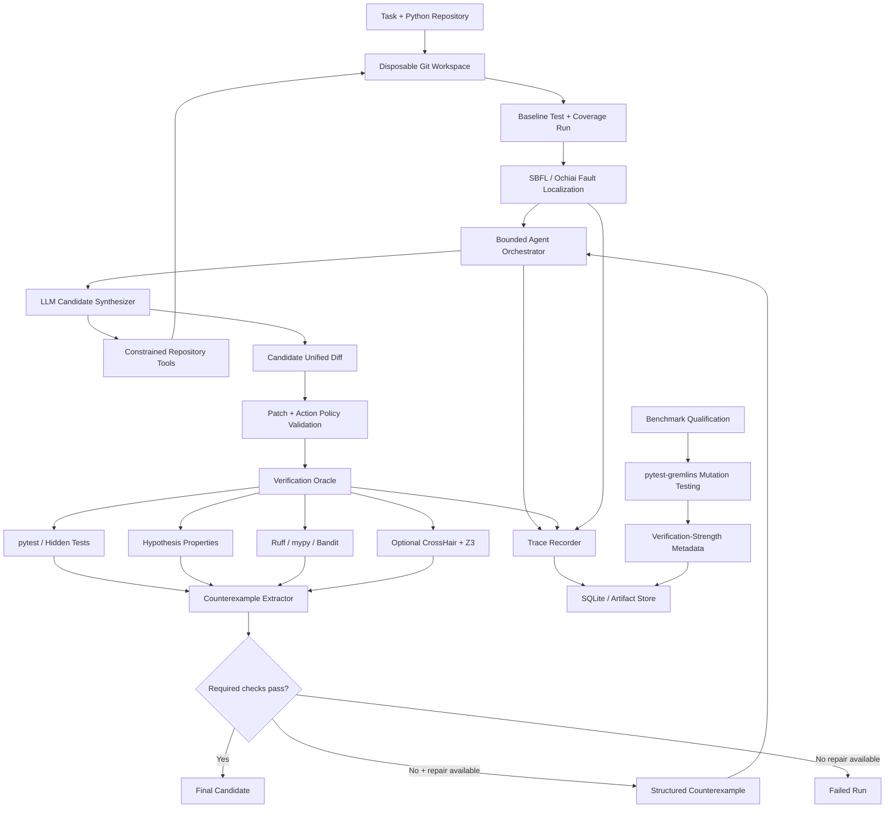

# AgentTrace

## Research-Ready Roadmap for Counterexample-Guided LLM Program Repair

---

## 1. Project Definition

**AgentTrace** is a research-oriented platform for studying how classical software-engineering and formal-verification techniques can improve the reliability of LLM-generated software patches.

A user gives AgentTrace a small Python repository and a software-maintenance task such as a bug report. The system allows an LLM-based coding agent to inspect the repository through constrained tools, localizes suspicious code using test-execution evidence, generates a candidate patch, and evaluates that patch through a structured verification oracle.

If verification finds a concrete failure, AgentTrace converts the failure into bounded counterexample feedback and gives the agent one opportunity to repair its patch. The complete process is recorded as an execution trace and evaluated experimentally.

The project is deliberately **not** intended to build the most autonomous coding agent. Its contribution is to study whether combining LLM-based program repair with established ideas from program synthesis, software testing, debugging, and formal methods produces more reliable and more efficient repairs.

### Central research idea

AgentTrace adapts **Counterexample-Guided Inductive Synthesis (CEGIS)** to LLM-based automated program repair.

Traditional CEGIS follows the pattern:

```text
Candidate Synthesis
        |
        v
Verification
        |
   +----+----+
   |         |
 PASS    Counterexample
   |         |
   v         v
Accept    Refine Candidate
             |
             +------> Verification
```

AgentTrace maps this idea to software repair:

```text
LLM Patch Synthesis
        |
        v
Verification Oracle
        |
   +----+-------------------------+
   |                              |
 PASS                      Counterexample
   |                              |
   v                              v
Candidate Accepted       Bounded LLM Repair
                                  |
                                  v
                         Replacement Patch
                                  |
                                  v
                            Re-verification
```

The LLM acts as the **candidate synthesizer**. Tests, property-based checks, static checks, and optional symbolic analysis form the **verification oracle**. Concrete failing inputs, failed assertions, regressions, and other structured failures act as **counterexamples**.

AgentTrace uses a **bounded CEGIS-inspired loop** rather than claiming complete formal synthesis. The system stops after one repair attempt in the main experiment.

---

## 2. Research Motivation

LLM coding agents can produce patches that are syntactically plausible and locally convincing while still being incorrect. Common failure modes include:

- fixing the visible symptom without satisfying the real requirement;
- introducing regressions elsewhere in the repository;
- making unnecessary or overly broad changes;
- hallucinating files, symbols, or APIs;
- overfitting to visible tests;
- failing on edge cases not represented in ordinary examples;
- spending large amounts of context and tool calls exploring irrelevant code.

AgentTrace studies three deeper problems behind these failures.

### 2.1 Can verification improve LLM repair?

A coding agent normally proposes a patch and stops. AgentTrace investigates whether deterministic evidence can be fed back into the repair process in a bounded CEGIS-style loop.

### 2.2 How strong is the verification oracle?

A patch passing a weak test suite is not necessarily reliable. AgentTrace therefore measures the fault-detection strength of benchmark test suites using **mutation testing** instead of treating all passing tests as equally meaningful.

### 2.3 Can classical debugging techniques make LLM agents more efficient?

LLMs often inspect many files before finding the relevant code. AgentTrace uses **Spectrum-Based Fault Localization (SBFL)** to rank suspicious program locations using passing and failing test executions, then evaluates whether this reduces exploration cost while preserving or improving repair accuracy.

---

## 3. Primary Research Questions

### RQ1 — Counterexample-guided repair

**How much does deterministic verification with one bounded counterexample-guided repair attempt improve the correctness of LLM-generated software patches?**

### RQ2 — Verification-oracle strength

**How does the fault-detection strength of a benchmark's test suite, measured through mutation testing, affect the reliability gains obtained from verification-assisted repair?**

### RQ3 — Counterexample quality

**Does concrete counterexample feedback generated through property-based testing improve LLM repair compared with conventional test-failure feedback alone?**

### RQ4 — Fault localization

**Does Spectrum-Based Fault Localization reduce repository exploration, token usage, and latency without reducing task-resolution accuracy?**

### Optional RQ5 — Symbolic verification

**For contract-friendly Python tasks, can SMT-backed symbolic execution discover counterexamples missed by example-based tests and property-based testing?**

---

## 4. Research Hypotheses

- **H1:** A constrained tool-using agent resolves more tasks than direct one-shot patch generation.
- **H2:** A bounded CEGIS-style verification-and-repair loop increases final task-resolution rate and reduces regression-producing patches.
- **H3:** Stronger verification oracles, as measured by mutation score, are associated with larger reliability gains from verification-assisted repair.
- **H4:** Property-based counterexamples improve repair success on edge-case-heavy tasks compared with raw test-failure logs alone.
- **H5:** SBFL-guided agents inspect fewer files and lines and use fewer tokens than unguided tool-using agents.
- **H6:** Optional symbolic checking can discover additional counterexamples on suitable typed and contract-specified functions, but will apply to only a subset of the benchmark.

---

## 5. Core Research Contributions

The project should be presented as the combination of the following research ideas.

### 5.1 Bounded CEGIS for LLM program repair

AgentTrace adapts **Counterexample-Guided Inductive Synthesis (CEGIS)** to automated software repair.

The system does not repeatedly allow an agent to modify code until something passes. Instead it uses a controlled sequence:

1. generate a candidate patch;
2. evaluate it against a verification oracle;
3. extract a structured counterexample if the candidate fails;
4. reset to the original repository state;
5. generate one replacement patch using the counterexample;
6. run the complete verification oracle again;
7. stop.

This bounded design makes experiments comparable and prevents indefinite self-repair loops.

### 5.2 Verification-oracle strength through mutation testing

AgentTrace uses **mutation testing** to evaluate whether a benchmark's tests are actually capable of detecting faulty behavior.

The Python library used is:

- **pytest-gremlins** — pytest-integrated mutation testing for Python.

AgentTrace runs mutation qualification natively on Windows through a small adapter
that normalizes pytest-gremlins terminology into the project-level killed,
survived, excluded/skipped/problematic, and mutation-score fields.

Mutation testing occurs during **benchmark qualification**, not after every agent patch.

For a benchmark repository:

1. run the baseline test suite;
2. generate small artificial mutations in production code;
3. run the tests against each mutant;
4. classify mutants as killed or survived;
5. calculate a mutation score;
6. store the score as metadata for that benchmark task/repository.

A basic metric is:

```text
mutation_score =
    killed_mutants /
    (killed_mutants + survived_mutants)
```

Equivalent, invalid, or infrastructure-failed mutants must be handled separately rather than silently counted.

Mutation score is used to analyze whether AgentTrace's verification loop works better when the underlying oracle is stronger.

### 5.3 Property-based counterexample generation

AgentTrace uses **Hypothesis**, the Python property-based testing library, for selected tasks where general behavioral properties can be expressed.

Unlike ordinary tests that check a small number of manually chosen examples, property-based tests define an input space and behavioral invariant. Hypothesis generates inputs and, when a failure is found, attempts to **shrink** it to a simpler failing example.

That minimal failing input becomes a high-quality counterexample for the repair loop.

Example:

```text
Property:
normalize(x) must preserve the number of valid records

Generated failing input:
[record_a, invalid_record, record_b, ...]

Shrunk counterexample:
[invalid_record]

Expected:
[]

Observed:
exception: IndexError
```

The agent receives the counterexample and failure summary, but not hidden test source code.

### 5.4 Spectrum-Based Fault Localization

AgentTrace uses **Spectrum-Based Fault Localization (SBFL)** to rank code locations according to how strongly they correlate with failing tests.

Required tools:

- **Coverage.py** for line execution data;
- **pytest-cov** where convenient for test-specific coverage contexts;
- an AgentTrace implementation of the **Ochiai suspiciousness metric**.

Coverage.py dynamic contexts can associate executed lines with individual tests. AgentTrace uses that information to construct a test-by-line execution matrix.

For each line:

- `ef` = failing tests that execute the line;
- `nf` = failing tests that do not execute the line;
- `ep` = passing tests that execute the line.

Ochiai suspiciousness is:

```text
                    ef
Ochiai = ---------------------------
          sqrt((ef + nf)(ef + ep))
```

The highest-ranked files, functions, and lines are given to the LLM as **evidence**, not as guaranteed fault locations.

Example:

```text
FAULT LOCALIZATION EVIDENCE

1. src/parser.py:43       Ochiai = 0.91
2. src/parser.py:42       Ochiai = 0.86
3. src/tokenizer.py:88    Ochiai = 0.54
```

The experiment measures whether this guidance reduces:

- files inspected;
- lines exposed to the model;
- tool calls;
- input tokens;
- latency;
- total cost.

### 5.5 Optional symbolic counterexample generation

For selected functions with suitable type annotations and contracts, AgentTrace can add a symbolic-analysis verification profile using:

- **CrossHair** — symbolic execution / contract checking for Python;
- **Z3** / `z3-solver` — the SMT solver used by CrossHair.

CrossHair attempts to explore program paths with symbolic inputs and find concrete counterexamples violating a contract.

Supported contract styles can include:

- Python `assert` statements;
- PEP 316-style contracts;
- `icontract`;
- `deal`.

This is an **optional research extension**, not a requirement for every benchmark task. It should be used only for deterministic, contract-friendly Python code.

The absence of a CrossHair counterexample must never be presented as proof that a patch is correct.

---

## 6. Supporting Technologies and Their Exact Roles

Not every technology has equal importance. The following distinction prevents the project from becoming a collection of unrelated tools.

### 6.1 Mandatory research technologies

| Technology / Library | Role |
|---|---|
| **CEGIS** | Conceptual framework for candidate generation, verification, counterexample production, and bounded refinement |
| **Hypothesis** | Property-based input generation and shrinking of failing examples into counterexamples |
| **pytest-gremlins** | Mutation testing used to quantify benchmark test-suite strength during benchmark qualification |
| **SBFL** | Classical debugging technique used to rank suspicious source locations |
| **Ochiai** | Suspiciousness metric used by the SBFL implementation |
| **Coverage.py** | Records line coverage and dynamic test contexts |
| **pytest-cov** | Convenient integration of pytest with coverage contexts |
| **pytest** | Primary deterministic test runner and benchmark oracle |
| **Windows restricted subprocess runner** | Executes trusted, pre-qualified benchmark code in disposable Git workspaces and isolated Python virtual environments with hard timeouts and sanitized environments |
| **Ruff** | Fast Python syntax/style/lint checks |
| **mypy** | Optional typed-code verification gate |
| **Bandit** | Advisory Python security/static-analysis gate |

### 6.2 Targeted advanced verification

| Technology / Library | Role |
|---|---|
| **CrossHair** | Symbolic execution and contract counterexample discovery for suitable Python functions |
| **Z3 / z3-solver** | SMT solving backend supporting symbolic constraint reasoning |

### 6.3 AgentTrace engineering stack

| Technology / Library | Role |
|---|---|
| **Python 3.12+** | Main implementation language |
| **FastAPI** | Local API and experiment-control service |
| **Pydantic** | Typed task, trace, tool, counterexample, and result schemas |
| **SQLAlchemy** | Persistence layer |
| **SQLite** | Local experiment database |
| **Git** | Repository version pinning, clean workspaces, and patch comparison |
| **ripgrep** | Fast bounded source search where available |
| **pandas** | Experiment result preparation |
| **matplotlib** | Reproducible research figures |

### 6.4 Trace standardization

AgentTrace should model its trace hierarchy with terminology compatible where practical with **OpenTelemetry GenAI semantic conventions**.

Relevant concepts include:

- agent invocation;
- model inference;
- planning;
- workflow;
- tool execution;
- errors;
- latency and operation attributes.

OpenTelemetry integration is **not the research contribution** and AgentTrace should not claim standards compliance unless its export is explicitly validated. The initial implementation may simply map its internal trace schema to compatible concepts.

### 6.5 Optional policy-as-code enforcement

**Open Policy Agent (OPA)** and its declarative policy language **Rego** can be used as an optional external policy-decision layer for agent actions.

Examples of policies:

- agent may not read hidden tests;
- agent may not access paths outside the disposable repository;
- patch may not modify `.git`;
- patch may not modify tests unless the task explicitly allows it;
- repair count must remain within the configured budget;
- file and patch-size limits must be respected.

OPA separates policy decisions from the Python code that enforces them.

This is valuable for a security/policy experiment but is **not required for the main empirical study**. The MVP can implement the same policies using typed Python validators.

### 6.6 Optional formal control-plane specification

A small **TLA+** specification can model AgentTrace's deterministic orchestration state machine. The **TLC model checker** can then search for violations of safety invariants.

Candidate invariants include:

- required verification must occur before a run can be marked successful;
- repair can occur at most once in the main configuration;
- hidden test source is never exposed to the agent;
- a patch cannot be accepted if required gates fail;
- a budget-exhausted run cannot re-enter model execution;
- repository reset occurs before a replacement patch is applied.

TLA+ is an optional formal-methods artifact for validating AgentTrace's control plane. It is not needed to execute the main program-repair experiment.

---

## 7. System Scope

### 7.1 Required scope

The core project supports:

- small Python repositories;
- bug-fixing tasks;
- local repository paths and optionally public Git URLs;
- a constrained LLM agent;
- safe repository inspection;
- unified-diff patch generation;
- SBFL fault-localization evidence;
- deterministic verification;
- Hypothesis properties for eligible tasks;
- one bounded CEGIS repair attempt;
- mutation-score metadata for benchmark quality;
- complete structured execution traces;
- a reproducible experiment runner;
- research analysis and failure classification.

### 7.2 Intentionally excluded from the core

The initial project does **not** require:

- autonomous merging or GitHub write access;
- cloud deployment;
- multi-agent orchestration;
- model fine-tuning;
- training a code model;
- support for multiple programming languages;
- unrestricted shell access;
- a large SWE-bench run;
- production security guarantees;
- a complex commercial frontend;
- repeated autonomous repair loops;
- automatic generation of an unlimited number of tests;
- mandatory CrossHair support for every task;
- mandatory OPA or TLA+ integration.

---

## 8. High-Level Architecture



---

## 9. The AgentTrace Repair Protocol

Every main run follows a fixed protocol.

### Stage 1 — Prepare

1. check out the exact benchmark base commit;
2. create an isolated disposable workspace;
3. verify path and repository constraints;
4. load task metadata;
5. record the configuration and model version.

### Stage 2 — Establish the baseline

1. run existing tests before modification;
2. identify passing and failing baseline tests;
3. collect per-test execution coverage;
4. verify that the benchmark's expected starting failure is reproducible.

### Stage 3 — Fault localization

1. build the test-by-line execution spectrum;
2. calculate Ochiai suspiciousness;
3. aggregate suspicious lines into useful file/function hints;
4. expose a small ranked localization summary to configurations that enable SBFL.

### Stage 4 — Candidate synthesis

The LLM may use only approved tools:

- `list_tree`;
- `read_file`;
- `search_code`;
- optional `inspect_symbol`;
- `submit_patch`.

The agent never receives unrestricted terminal access.

### Stage 5 — Candidate validation

Before execution:

- parse the unified diff;
- reject forbidden paths;
- enforce patch-size and file-count limits;
- reject hidden-test modifications;
- reject `.git` modifications;
- reject path traversal;
- confirm the patch applies cleanly.

### Stage 6 — Verification oracle

Run required and advisory checks in a deterministic order.

Recommended order:

1. patch application;
2. Python compilation / syntax check;
3. targeted visible tests;
4. complete baseline test suite;
5. hidden tests;
6. task-specific Hypothesis properties;
7. Ruff;
8. mypy where configured;
9. Bandit;
10. optional CrossHair contract analysis.

### Stage 7 — Counterexample extraction

If a required check fails, convert the evidence into a typed `Counterexample`.

Example schema:

```yaml
counterexample_id: ce-001
source: hypothesis
gate: behavioral_property
status: failed
failing_test: test_parser_preserves_empty_input
input:
  text: ""
expected:
  result: []
observed:
  exception: IndexError
is_new_vs_baseline: true
location_hints:
  - src/parser.py:43
log_excerpt: "..."
```

Possible counterexample sources:

- `PYTEST_FAILURE`;
- `HIDDEN_TEST_FAILURE`;
- `HYPOTHESIS_COUNTEREXAMPLE`;
- `REGRESSION`;
- `SYNTAX_ERROR`;
- `TYPE_FAILURE`;
- `POLICY_VIOLATION`;
- `CROSSHAIR_COUNTEREXAMPLE`.

### Stage 8 — Bounded repair

If the configuration permits repair:

1. preserve the first patch;
2. sanitize the counterexample;
3. return only bounded failure evidence to the LLM;
4. allow additional repository inspection within the remaining budget;
5. request a complete replacement patch;
6. reset the workspace to the original base commit;
7. apply the replacement patch;
8. rerun the full verification oracle;
9. stop.

No third patch is allowed in the primary experiment.

---

## 10. Core Data Model

The research data model should be small and experiment-focused.

### Repository

- `repository_id`
- `name`
- `source`
- `base_commit`
- `python_version`
- `test_command`

### Task

- `task_id`
- `repository_id`
- `title`
- `description`
- `task_category`
- `difficulty`
- `allowed_paths`
- `forbidden_paths`
- `visible_test_command`
- `hidden_test_command`
- `property_profile`
- `symbolic_profile`
- `known_correct_patch`

### BenchmarkQuality

- `task_id`
- `baseline_status`
- `mutation_tool`
- `mutation_score`
- `mutants_killed`
- `mutants_survived`
- `mutants_excluded`
- `quality_notes`

### Run

- `run_id`
- `task_id`
- `configuration_id`
- `model`
- `model_parameters`
- `status`
- `started_at`
- `finished_at`
- `latency_ms`
- `input_tokens`
- `output_tokens`
- `estimated_cost`
- `tool_calls`
- `files_read`
- `lines_exposed`
- `repair_attempted`
- `final_resolution`
- `failure_category`

### FaultLocalizationResult

- `run_id`
- `metric`
- `ranked_locations`
- `top_k`
- `fault_rank_if_known`
- `coverage_artifact`

### PatchArtifact

- `run_id`
- `attempt_number`
- `unified_diff`
- `files_changed`
- `lines_added`
- `lines_removed`
- `applied_successfully`

### VerificationResult

- `run_id`
- `attempt_number`
- `gate`
- `required`
- `status`
- `exit_code`
- `duration_ms`
- `baseline_difference`
- `summary`
- `log_artifact`

### Counterexample

- `run_id`
- `attempt_number`
- `source`
- `gate`
- `input_summary`
- `expected_summary`
- `observed_summary`
- `location_hints`
- `is_new_vs_baseline`
- `sanitized_feedback`

### TraceEvent

- `run_id`
- `sequence_number`
- `parent_event_id`
- `operation`
- `started_at`
- `finished_at`
- `status`
- `input_summary`
- `output_summary`
- `error_type`

---

## 11. Benchmark Design

### 11.1 Target benchmark size

The initial research benchmark should contain approximately **15–20 validated Python repair tasks**.

Prefer quality over scale.

Suggested composition:

- boundary-condition bugs;
- empty/null input bugs;
- incorrect validation logic;
- data-transformation bugs;
- parsing bugs;
- small algorithmic bugs;
- API/business-rule bugs.

Avoid tasks that depend on:

- paid services;
- live networks;
- large external datasets;
- GUIs;
- GPUs;
- major architectural rewrites.

### 11.2 Benchmark task requirements

Each task must have:

- a fixed base commit;
- a reproducible incorrect behavior;
- a clear natural-language task;
- visible tests where appropriate;
- hidden correctness tests;
- a known correct patch;
- baseline verification results;
- benchmark-quality metadata;
- at least one failure mode that the evaluation can classify.

For property-based tasks, also include:

- a property specification;
- a bounded Hypothesis strategy;
- hidden property-test implementation;
- a safe method of returning a shrunk counterexample without exposing hidden source.

For symbolic tasks, optionally include:

- typed target functions;
- preconditions/postconditions or supported contracts;
- a bounded CrossHair timeout.

### 11.3 Mutation qualification

Before a task is admitted:

1. verify the expected bug;
2. apply the known correct patch and confirm all intended checks pass;
3. run `pytest-gremlins` against the relevant production code;
4. store mutation statistics;
5. inspect obvious surviving mutants where practical;
6. flag tasks whose test suite is too weak to distinguish meaningful faults.

Do not automatically discard every low-mutation-score task. Some can be intentionally retained to study RQ2.

---

## 12. Experimental Configurations

The project should prioritize a small number of interpretable conditions.

### Configuration A — Direct Patch Baseline

- deterministic prepared repository context;
- no iterative repository tools;
- one LLM patch;
- verification used only for measurement;
- no feedback;
- no repair.

Purpose:

> establishes the basic one-shot LLM baseline.

### Configuration B — Tool Agent

- constrained repository tools;
- no SBFL hint;
- one patch;
- verification used only for measurement;
- no repair.

Purpose:

> isolates the value of interactive repository inspection.

### Configuration C — Verified CEGIS Agent

- constrained repository tools;
- ordinary test evidence;
- one patch;
- deterministic verification;
- one structured failure response;
- one replacement patch;
- full re-verification.

Purpose:

> measures the value of bounded counterexample-guided repair.

### Configuration D — Research-Enhanced CEGIS Agent

- SBFL/Ochiai localization hint;
- constrained repository tools;
- standard verification;
- Hypothesis counterexamples where task-supported;
- optional CrossHair counterexamples for eligible tasks;
- one replacement patch;
- full re-verification.

Purpose:

> evaluates the combined research-enhanced architecture.

### Focused ablations

The main benchmark need not multiply into many expensive configurations. Instead, use a smaller subset of eligible tasks for focused ablations.

#### D1 — CEGIS + SBFL only

Tests whether localization improves efficiency.

#### D2 — CEGIS + Hypothesis only

Tests whether property-based counterexamples improve repair.

#### D3 — CEGIS + CrossHair

Only on suitable contract-friendly tasks.

These ablations allow RQ3–RQ5 to be investigated without requiring every task to support every technique.

---

## 13. Evaluation Metrics

### 13.1 Primary correctness metric

**Task resolution rate**

A run is resolved only when:

- the patch applies;
- required baseline tests pass;
- hidden correctness tests pass;
- no new required regression appears;
- required task-specific properties pass.

### 13.2 Reliability metrics

- hidden-test pass rate;
- regression rate;
- invalid-patch rate;
- patch-application failure rate;
- first-patch success rate;
- repair success rate;
- counterexample-to-success conversion rate.

### 13.3 Verification-strength metrics

- mutation score;
- mutants killed;
- mutants survived;
- relationship between mutation score and repair outcome.

### 13.4 Agent-efficiency metrics

- tool-call count;
- files inspected;
- lines exposed to the model;
- SBFL top-k fault rank where ground truth is known;
- input tokens;
- output tokens;
- model cost;
- model latency;
- verification latency;
- total run latency.

### 13.5 Patch-quality diagnostics

- files changed;
- lines added;
- lines removed;
- unnecessary-change label;
- forbidden-change attempts;
- target-only fix versus broad rewrite.

### 13.6 Counterexample metrics

- counterexample source;
- counterexample generated or unavailable;
- Hypothesis shrink size;
- repair after conventional failure feedback;
- repair after property-based counterexample;
- symbolic counterexample discovery rate on eligible tasks.

---

## 14. Failure Taxonomy

Use one primary failure label and optional secondary labels.

```text
MISUNDERSTOOD_REQUIREMENT
INSUFFICIENT_REPOSITORY_INSPECTION
FAULT_LOCALIZATION_MISLEADING
HALLUCINATED_PATH_OR_SYMBOL
INVALID_PATCH
PATCH_DID_NOT_APPLY
VISIBLE_TEST_FAILURE
HIDDEN_TEST_FAILURE
PROPERTY_FAILURE
REGRESSION
LINT_FAILURE
TYPE_FAILURE
SECURITY_WARNING
POLICY_VIOLATION
CROSSHAIR_COUNTEREXAMPLE
REPAIR_FAILED
REPAIR_INTRODUCED_REGRESSION
TOOL_MISUSE
TOOL_BUDGET_EXHAUSTED
EXCESSIVE_CHANGE
TIMEOUT
INFRASTRUCTURE_FAILURE
MODEL_PROVIDER_FAILURE
```

The taxonomy may be refined after the pilot, but it must be frozen before the main experiment.

---

## 15. Security and Isolation Model

AgentTrace evaluates generated code natively on Windows. Its execution boundary is
therefore restricted to **trusted, controlled, pre-qualified benchmark
repositories**; it is not a service for executing arbitrary untrusted
third-party repositories. Native Windows subprocess isolation is weaker than
VM/container isolation, so this trust restriction is part of the research
contract rather than an implementation detail.

### Required controls

- disposable repository workspace for every run;
- original repository never modified;
- a dedicated temporary Python virtual environment where required;
- controlled subprocess invocation with explicit argument arrays and working directories;
- hard wall-clock timeouts and termination of timed-out process trees;
- a sanitized allowlisted process environment that excludes provider credentials, API keys, `.env` values, and unrelated host secrets;
- captured and bounded stdout and stderr;
- path normalization and traversal rejection;
- symlink escape protection;
- forbidden hidden-test paths;
- no unrestricted shell tool exposed to the LLM;
- bounded file reads;
- bounded search results;
- bounded patch size;
- bounded tool calls;
- one repair attempt.

These controls provide reproducible experiment boundaries and reduce accidental
host exposure, but they are not a production-grade sandbox or a formal security
guarantee.

### Optional policy-as-code profile

If OPA/Rego is implemented, all tool and patch requests can be represented as structured policy inputs before execution.

The Python orchestrator remains the enforcement point; OPA returns the decision.

---

## 16. Trace and Reproducibility Model

AgentTrace should record observable behavior, not claim access to private model reasoning.

A run trace may contain:

```text
run
├── prepare_workspace
├── baseline
│   ├── tests
│   └── coverage
├── fault_localization
├── agent_workflow
│   ├── model_call
│   ├── tool_call
│   ├── model_call
│   └── submit_patch
├── verification
│   ├── syntax
│   ├── pytest
│   ├── hidden_tests
│   ├── hypothesis
│   ├── ruff
│   ├── mypy
│   ├── bandit
│   └── optional_crosshair
├── counterexample
├── optional_repair
└── final_result
```

### Record

- model and model parameters;
- prompts or safe prompt hashes;
- tool calls;
- bounded tool outputs;
- patches;
- verification results;
- counterexamples;
- SBFL rankings;
- token usage;
- cost;
- latency;
- configuration;
- code commit;
- benchmark version;
- frozen Windows environment fingerprint.

### Frozen Windows experiment environment

Before the main experiment, AgentTrace records a canonical environment manifest
containing the Windows version, Python version, pytest, Hypothesis, Coverage.py,
pytest-cov, pytest-gremlins, Ruff, mypy, Bandit, and installed CrossHair/Z3
versions; the dependency-lock hash; AgentTrace source commit; benchmark version;
and verification profile. A stable hash of this manifest is the experiment
environment identifier. It replaces machine-specific paths and must remain
fixed for all comparable runs.

### Redact

- API keys;
- authorization headers;
- `.env` contents;
- hidden-test source;
- secrets discovered in repositories;
- oversized raw logs where a hashed artifact is sufficient.

### OpenTelemetry alignment

Where practical, use trace-operation names compatible with the vocabulary of OpenTelemetry GenAI semantic conventions, such as:

- `invoke_agent`;
- `plan`;
- model inference;
- workflow;
- execute tool.

This keeps future trace export possible without making OpenTelemetry a dependency of the core experiment.

---

## 17. Minimal User Interface

A large application frontend is unnecessary for the research contribution.

The local interface only needs to support:

### Run creation

- repository;
- task;
- configuration;
- model;
- verification profile.

### Run inspection

- final result;
- first and repaired patch;
- verification gates;
- counterexample;
- SBFL ranking;
- token/cost/latency summary;
- ordered trace.

### Experiment results

- configuration comparison;
- task-resolution counts;
- regression counts;
- mutation-score relationship;
- cost and latency summaries;
- failure-category counts.

A minimal React/Vite interface can be used, but the experiment runner and exported analysis remain more important than visual polish.

---

## 18. Project Structure

```text
agentrace/
├── backend/
│   ├── app/
│   │   ├── api/
│   │   ├── agent/
│   │   │   ├── orchestrator.py
│   │   │   ├── model_provider.py
│   │   │   └── prompts/
│   │   ├── benchmark/
│   │   ├── counterexamples/
│   │   ├── db/
│   │   ├── fault_localization/
│   │   │   ├── coverage_reader.py
│   │   │   ├── spectrum.py
│   │   │   └── ochiai.py
│   │   ├── policies/
│   │   ├── repositories/
│   │   ├── schemas/
│   │   ├── tools/
│   │   ├── tracing/
│   │   └── verification/
│   │       ├── pytest_gate.py
│   │       ├── hypothesis_gate.py
│   │       ├── static_gates.py
│   │       └── crosshair_gate.py
│   └── tests/
├── benchmark/
│   ├── repositories/
│   ├── tasks/
│   ├── hidden_tests/
│   ├── properties/
│   └── mutation_results/
├── experiments/
│   ├── configs/
│   ├── raw/
│   ├── derived/
│   └── analysis/
├── formal/
│   └── tla/
├── policies/
│   └── rego/
├── frontend/
├── docs/
│   ├── literature/
│   ├── methodology/
│   └── report/
├── artifacts/
├── scripts/
├── pyproject.toml
├── .env.example
└── README.md
```

The `formal/tla/` and `policies/rego/` directories may remain empty if those optional extensions are not implemented.

---

## 19. Implementation Roadmap

### Phase 0 — Freeze the Research Contract

### Objective

Define exactly what AgentTrace is trying to test before implementation begins.

### Tasks

- finalize RQ1–RQ4;
- mark RQ5 as optional;
- define Configurations A–D;
- define repair budget as exactly one;
- define required metrics;
- define benchmark eligibility;
- define what counts as task resolution;
- document optional versus mandatory technologies.

### Deliverable

`docs/methodology/research-contract.md`

### Exit criteria

The research contribution can be explained without discussing the frontend or infrastructure.

---

### Phase 1 — Build a Focused Research Foundation

### Objective

Study the methods being integrated before coding them.

### Literature areas

1. LLM automated program repair and coding agents;
2. Counterexample-Guided Inductive Synthesis;
3. property-based testing;
4. mutation testing;
5. Spectrum-Based Fault Localization;
6. symbolic execution / SMT-based software analysis;
7. coding-agent evaluation and test-oracle quality.

### Literature matrix fields

- citation;
- research question;
- method;
- benchmark;
- metrics;
- result;
- limitation;
- exact relevance to AgentTrace.

### Deliverable

`docs/literature/literature-matrix.md`

### Exit criteria

Each major AgentTrace research component has a cited methodological reason for existing.

---

### Phase 2 — Build the Safe Repository and Experiment Foundation

### Objective

Create the minimum engineering base required for valid experiments.

### Tasks

- FastAPI application;
- Pydantic schemas;
- SQLite + SQLAlchemy;
- typed configuration;
- repository registration;
- base-commit recording;
- disposable Git workspaces;
- safe path resolution;
- artifact storage;
- structured service logging;
- fake model provider for tests.

### Required tests

- path traversal;
- symlink escape;
- forbidden hidden-test access;
- clean repository reset;
- database schema validation;
- artifact hashing.

### Exit criteria

A task can be loaded into a disposable repository without any LLM integration.

---

### Phase 3 — Build the Benchmark and Verification-Strength Pipeline

### Objective

Create validated tasks and quantify their verification quality before the agent experiment.

### Tasks

- create initial fixture repositories;
- define task YAML schema;
- separate visible and hidden tests;
- add known correct patches;
- verify base failures;
- add `pytest-gremlins`;
- record mutation statistics;
- define task categories and difficulty.

### Research output

For each task:

```yaml
task_id: parser-001
base_commit: abc123
baseline_failure: true
mutation_score: 0.82
mutants_killed: 41
mutants_survived: 9
property_testing: true
symbolic_testing: false
```

### Exit criteria

At least three pilot tasks have reproducible baseline behavior and mutation-quality metadata.

---

### Phase 4 — Implement SBFL Fault Localization

### Objective

Provide evidence-based code-localization hints instead of relying entirely on LLM search.

### Tasks

- run tests with Coverage.py dynamic contexts;
- build the test-line coverage matrix;
- parse pass/fail outcomes;
- implement Ochiai;
- rank lines;
- aggregate into file/function summaries;
- store localization results;
- write correctness tests for the metric.

### Validate

For tasks with a known faulty line or function, measure:

- rank of the true faulty location;
- Top-1;
- Top-5;
- Top-10 containment.

### Exit criteria

A pilot task produces a reproducible suspiciousness ranking before any LLM call.

---

### Phase 5 — Implement the Constrained LLM Agent

### Objective

Build a small inspect-and-patch agent without a general shell.

### Tools

- `list_tree`;
- `read_file`;
- `search_code`;
- optional `inspect_symbol`;
- `submit_patch`.

### Controls

- path validation;
- output limits;
- read budgets;
- tool-call budgets;
- patch-size budgets;
- allowed and forbidden paths.

### Configurations implemented

- Configuration A;
- Configuration B.

### Exit criteria

The same pilot task can be run as one-shot direct patch generation and as a constrained tool-using agent.

---

### Phase 6 — Build the Verification Oracle

### Objective

Turn candidate patches into deterministic evidence.

### Mandatory gates

- patch applies;
- Python syntax/compile;
- visible tests;
- full baseline test suite;
- hidden tests.

### Research gates

- Hypothesis property tests for eligible tasks.

### Advisory gates

- Ruff;
- mypy when configured;
- Bandit.

### Optional gate

- CrossHair + Z3 for selected contract-friendly tasks.

### Requirements

Every gate must return:

- status;
- duration;
- summary;
- log artifact;
- baseline difference;
- structured failure evidence.

### Exit criteria

Known correct, incorrect, regression-producing, and edge-case-failing patches are distinguishable.

---

### Phase 7 — Implement Counterexample Extraction and Bounded CEGIS Repair

### Objective

Create the central research mechanism.

### Tasks

- define the `Counterexample` schema;
- parse pytest failures;
- capture hidden-test symptoms without source leakage;
- capture Hypothesis shrunk examples;
- capture new regressions;
- parse optional CrossHair counterexamples;
- produce bounded repair feedback;
- reset to the base commit before repair;
- generate exactly one replacement patch;
- rerun the full verifier.

### Configuration implemented

- Configuration C.

### Exit criteria

A pilot task can fail on the first patch, return a structured counterexample, produce a replacement patch, and stop after re-verification.

---

### Phase 8 — Integrate the Research-Enhanced Configuration

### Objective

Combine the research techniques into a single experimental condition.

### Configuration D

Enable:

- SBFL localization;
- constrained tools;
- standard verifier;
- Hypothesis counterexamples where supported;
- optional CrossHair evidence;
- one bounded repair.

### Important rule

The LLM must be able to distinguish:

- localization evidence;
- deterministic failure evidence;
- advisory warnings.

None should be presented as guaranteed truth.

### Exit criteria

Configurations A–D run through the same experiment interface and write the same result schema.

---

### Phase 9 — Trace, Experiment Runner, and Pilot Study

### Objective

Make the study reproducible before scaling it.

### Tasks

- canonical trace recorder;
- model/tool/verification timing;
- token and cost recording;
- OpenTelemetry-compatible naming where useful;
- JSON trace export;
- configuration-driven experiment runner;
- resumable runs;
- raw versus derived results separation;
- failure taxonomy;
- pilot experiment.

### Pilot

Run at least:

- 3 tasks;
- Configurations A–D;
- focused SBFL/Hypothesis ablations where applicable.

Inspect every trace manually.

### Exit criteria

Metrics agree with the underlying traces and infrastructure failures can be separated from agent failures.

---

### Phase 10 — Main Experiment

### Objective

Run the frozen comparative study.

### Minimum main experiment

- 15 validated tasks;
- Configurations A–D;
- one fixed model;
- fixed model settings;
- frozen prompts;
- frozen task versions;
- frozen verification profile;
- frozen tool/repair budgets.

This produces at least **60 main runs**.

If budget allows, repeated runs are preferable to adding more application features.

### Focused sub-experiments

On suitable subsets:

- C versus C+SBFL;
- C versus C+Hypothesis;
- test-only CEGIS versus symbolic-enhanced CEGIS;
- outcomes grouped by mutation-score range.

### Exit criteria

Every planned run is complete or has a documented infrastructure-exclusion reason.

---

### Phase 11 — Analysis and Research Report

### Objective

Convert the system into a defensible empirical research artifact.

### Core analysis

By configuration:

- resolved tasks;
- resolution rate;
- regressions;
- first-patch success;
- repair success;
- median cost;
- median latency;
- median tool calls;
- median files and lines inspected.

### Mutation analysis

Investigate:

- mutation score versus resolution;
- mutation score versus repair success;
- low-oracle-strength false confidence cases;
- examples where all ordinary tests passed but stronger checks found faults.

### SBFL analysis

Investigate:

- true-fault rank;
- Top-k localization;
- exploration reduction;
- token reduction;
- latency change;
- cases where SBFL misled the agent.

### Counterexample analysis

Compare:

- ordinary pytest failure feedback;
- Hypothesis-shrunk counterexamples;
- optional CrossHair counterexamples.

### Qualitative case studies

Include at least:

1. a task solved only after counterexample-guided repair;
2. a weak test suite exposed by mutation testing;
3. an SBFL hint that reduced exploration;
4. an SBFL failure or misleading ranking;
5. a property-based edge case missed by ordinary tests;
6. an optional symbolic counterexample if available.

### Deliverable

A concise research-style report:

1. Abstract
2. Introduction
3. Related Work
4. AgentTrace Design
5. CEGIS Adaptation
6. Experimental Methodology
7. Results
8. Fault-Localization Analysis
9. Verification-Oracle Analysis
10. Counterexample Analysis
11. Failure Cases
12. Threats to Validity
13. Limitations
14. Conclusion

---

### Phase 12 — Optional Formal and Policy Extensions

Complete these only after the main experiment works.

### 12.1 TLA+ / TLC

Model the deterministic orchestration and check safety invariants.

Potential value:

> demonstrates that formal methods were used not only for patch checking but also to reason about the agent-control protocol.

### 12.2 OPA / Rego

Move agent-action policies into policy-as-code.

Potential experiment:

> compare maintainability and auditability of hard-coded Python validators with declarative Rego policies.

These extensions should never delay the main study.

---

## 20. Four-Week Build Schedule

### Week 1 — Research, benchmark, and safe foundation

- Phase 0 — Research contract
- Phase 1 — Focused literature review
- Phase 2 — Repository foundation
- Phase 3 — First benchmark tasks and mutation testing
- begin Phase 4 — SBFL

**Milestone:** a validated Python task has baseline tests, mutation score, coverage spectra, and an Ochiai suspiciousness ranking.

### Week 2 — Agent and verification

- finish Phase 4 — SBFL
- Phase 5 — Direct and tool-agent baselines
- Phase 6 — Verification oracle
- integrate Hypothesis
- begin optional CrossHair fixture work

**Milestone:** an LLM generates a patch and AgentTrace produces deterministic verification evidence.

### Week 3 — CEGIS, traces, and benchmark completion

- Phase 7 — Counterexample-guided repair
- Phase 8 — Research-enhanced configuration
- Phase 9 — Trace and experiment runner
- grow benchmark toward 15 tasks
- run pilot

**Milestone:** A–D configurations execute end-to-end and a failed patch can be repaired from a structured counterexample.

### Week 4 — Main experiment and research package

- freeze experiment
- Phase 10 — Main experiment
- Phase 11 — Analysis
- minimal interface polish
- reproducibility check
- research report
- README and demonstration
- optional TLA+/OPA only if time remains

**Milestone:** a reproducible local research artifact with empirical findings rather than only a working coding agent.

---

## 21. Priority Order if Time Becomes Limited

Preserve work in this order:

1. benchmark validity;
2. safe disposable workspaces;
3. direct baseline;
4. constrained tool agent;
5. deterministic verification;
6. CEGIS-style counterexample repair;
7. `pytest-gremlins` verification-strength measurement;
8. Hypothesis counterexamples;
9. SBFL + Ochiai;
10. trace and experiment runner;
11. main experiment;
12. results analysis;
13. minimal UI;
14. CrossHair + Z3;
15. TLA+;
16. OPA/Rego;
17. visual polish.

Do not sacrifice the experiment to build optional infrastructure.

---

## 22. Success Criteria

AgentTrace is research-ready when:

- at least 15 Python repair tasks are manually validated;
- benchmark tasks have test-oracle quality metadata from mutation testing;
- Configurations A–D are precisely reproducible;
- the agent has no unrestricted shell tool;
- repository code runs only from disposable workspaces through the restricted Windows verifier, and only for trusted, pre-qualified benchmark repositories;
- SBFL/Ochiai localization is reproducible;
- Hypothesis produces concrete counterexamples on eligible tasks;
- the CEGIS-style configuration allows no more than one repair;
- initial and replacement patches are preserved independently;
- hidden tests cannot be read or modified by the agent;
- raw experiment traces are immutable;
- resolution, regression, cost, latency, exploration, and repair metrics are reported;
- failed runs are categorized;
- the final report explicitly analyzes how verification-oracle strength affects conclusions;
- limitations distinguish empirical reliability from formal proof;
- the code, benchmark, prompts, model settings, and analysis correspond to recorded versions.

---

## 23. Claims AgentTrace May and May Not Make

## Defensible claims

If supported by the experiment, AgentTrace may claim that:

- bounded verification feedback improved repair success on the evaluated tasks;
- stronger test oracles were associated with different repair outcomes;
- property-based testing discovered edge cases missed by ordinary examples;
- SBFL reduced repository exploration or improved localization on the evaluated benchmark;
- symbolic analysis found additional counterexamples on supported functions;
- the system provides traceable evidence for each patch decision.

## Claims to avoid

AgentTrace must not claim that:

- passing tests proves semantic correctness;
- CEGIS makes the LLM formally correct;
- mutation score is a complete measure of software quality;
- CrossHair proves arbitrary Python programs correct;
- native Windows subprocess restrictions make arbitrary untrusted code safe to execute;
- SBFL always identifies the real fault;
- results from small Python tasks generalize to all software engineering;
- OpenTelemetry alignment means complete standards compliance;
- a one-model experiment proves behavior for all LLMs.

---

## 24. Final Research Narrative

The project should be communicated in this form:

> **AgentTrace investigates whether classical software-engineering and formal-methods techniques can make LLM-based automated program repair more reliable. The system adapts a bounded Counterexample-Guided Inductive Synthesis workflow: an LLM synthesizes a candidate patch, a deterministic verification oracle evaluates it, and concrete failures are returned as counterexamples for one controlled repair attempt. The verification oracle combines conventional tests with property-based testing through Hypothesis and optional SMT-backed symbolic analysis through CrossHair and Z3. Mutation testing with pytest-gremlins measures how strong each benchmark's test oracle actually is, while Spectrum-Based Fault Localization using Coverage.py and the Ochiai metric evaluates whether execution evidence can reduce the agent's repository exploration. AgentTrace records the complete observable execution trace and compares multiple agent configurations through a reproducible empirical study.**

This narrative should remain the center of the README, research report, application description, and interview explanation.

---

## 25. Technology Checklist

## Core research

- [ ] Counterexample-Guided Inductive Synthesis (**CEGIS**) adaptation
- [ ] **Hypothesis**
- [ ] **pytest-gremlins**
- [ ] Spectrum-Based Fault Localization (**SBFL**)
- [ ] **Ochiai** suspiciousness metric
- [ ] **Coverage.py**
- [ ] **pytest-cov**
- [ ] **pytest**

## Verification and isolation

- [ ] Native Windows restricted subprocess runner
- [ ] Disposable Git workspaces and isolated Python virtual environments
- [ ] Sanitized process environments and hard timeouts
- [ ] **Ruff**
- [ ] **mypy**
- [ ] **Bandit**

## Advanced research profile

- [ ] **CrossHair**
- [ ] **Z3 / z3-solver**

## Core application

- [ ] **Python 3.12+**
- [ ] **FastAPI**
- [ ] **Pydantic**
- [ ] **SQLAlchemy**
- [ ] **SQLite**
- [ ] **Git**
- [ ] **ripgrep**
- [ ] **pandas**
- [ ] **matplotlib**

## Trace and optional formal extensions

- [ ] OpenTelemetry GenAI semantic-convention alignment
- [ ] Optional **TLA+**
- [ ] Optional **TLC model checker**
- [ ] Optional **Open Policy Agent (OPA)**
- [ ] Optional **Rego**

---

## 26. First Concrete Build Session

Complete the following before any large agent implementation:

1. create the reduced repository structure;
2. write `docs/methodology/research-contract.md`;
3. define the Pydantic schemas for `Task`, `Run`, `PatchArtifact`, `VerificationResult`, `Counterexample`, and `FaultLocalizationResult`;
4. initialize FastAPI and SQLite;
5. build one tiny Python fixture repository containing an intentional bug;
6. create visible and hidden tests for it;
7. implement disposable Git workspace creation;
8. run the baseline test suite in a disposable workspace through the restricted Windows verifier;
9. run Coverage.py with per-test contexts;
10. calculate an Ochiai ranking;
11. run `pytest-gremlins` and save the mutation score;
12. write one Hypothesis property capable of producing a counterexample for the fixture bug;
13. implement `list_tree`, `read_file`, and `search_code`;
14. add path, hidden-test, and symlink protections;
15. commit this foundation before connecting the real LLM.

At the end of the first build session, AgentTrace should already contain its research foundations: a benchmark task, a verification-quality measure, fault-localization evidence, a counterexample generator, and a safe execution boundary. The LLM is added only after these foundations are measurable and reproducible.

---

## 27. Recommended Research and Technology References

These are the primary references to study while implementing the project. They are included to make the technology choices traceable to established methods rather than treating them as arbitrary dependencies.

### CEGIS and program synthesis

- Armando Solar-Lezama, MIT Program Synthesis course, **Lecture 10: Counterexample Guided Inductive Synthesis**.
- Focus on the generate–check–counterexample–refine structure and on the role of the checker in producing useful counterexamples.

### Property-based testing

- **Hypothesis documentation** — property-based testing, strategies, generation, shrinking, and failure explanation.
- Study how failing examples are minimized before designing the `Counterexample` schema.

### Mutation testing

- **pytest-gremlins documentation** — pytest-integrated Python mutation testing.
- Use mutation score as benchmark-oracle metadata, not as a runtime gate after every agent patch.

### Spectrum-Based Fault Localization

- Study classical **SBFL** and the **Ochiai** suspiciousness metric.
- **Coverage.py measurement contexts** document how execution can be associated with individual test contexts.
- **pytest-cov** can be used to integrate per-test coverage collection with pytest.

### Symbolic execution and SMT

- **CrossHair documentation** — symbolic Python execution, contracts, counterexample search, and limitations.
- **Z3 Guide** — SMT solving and Python bindings through `z3-solver`.
- Treat symbolic analysis as targeted counterexample discovery, not universal proof of correctness.

### Agent tracing

- **OpenTelemetry GenAI semantic conventions** — agent invocation, workflow, planning, inference, and tool-execution span terminology.
- The GenAI conventions are evolving; AgentTrace should use them as trace-structure guidance unless explicit compliance is later validated.

### Policy-as-code

- **Open Policy Agent documentation**.
- **Rego policy language documentation**.
- Use only if the optional policy layer is implemented after the main experiment.

### Formal state-machine validation

- Leslie Lamport's **TLA+** material and the **TLC model checker**.
- Use TLC to search for invariant violations in the deterministic AgentTrace orchestration model if the optional formal-control-plane extension is completed.

---

## 28. Final Scope Decision

To keep AgentTrace feasible and research-focused, the implementation should be treated in three tiers.

### Tier 1 — Must be completed

- bounded CEGIS-style repair;
- constrained LLM repository tools;
- native Windows verification for trusted, pre-qualified benchmark repositories;
- pytest and hidden tests;
- Hypothesis counterexample generation on eligible tasks;
- pytest-gremlins benchmark qualification;
- SBFL with Coverage.py and Ochiai;
- structured traces;
- Configurations A–D;
- reproducible experiment runner;
- main empirical analysis.

### Tier 2 — Complete if the benchmark supports it

- CrossHair;
- Z3 / `z3-solver`;
- symbolic contract counterexamples;
- focused symbolic-analysis sub-experiment.

### Tier 3 — Only after the main research result exists

- TLA+ / TLC state-machine model;
- OPA / Rego policy-as-code layer;
- full OpenTelemetry trace export;
- extensive frontend polish.

This tiering is part of the project definition. A completed Tier 1 AgentTrace with a good experiment is a stronger research artifact than a partially completed system containing every optional technology.
